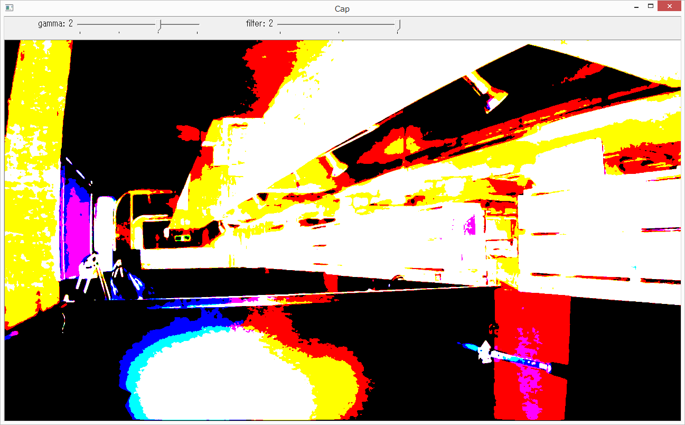

# videocap

## Description

* This software displays frames captured from camera.

## How to build

```
go build
```

## Command Line Options

```
C:\>videocap -h
Usage of videocap:
  -cam_idx int
        the camera index to use
  -face_detect
        the flag to use face detection (default true)
  -file string
        the path to record video
  -filter int
        the number of filter. 0:none, 1:binary+edge, 2:ohtsu
  -size string
        the size to be captured (default "640x480")
  -wait_ms int
        the interval ms (default 100)
```

# Screenshots

* Using filter 1


* Using filter 2


