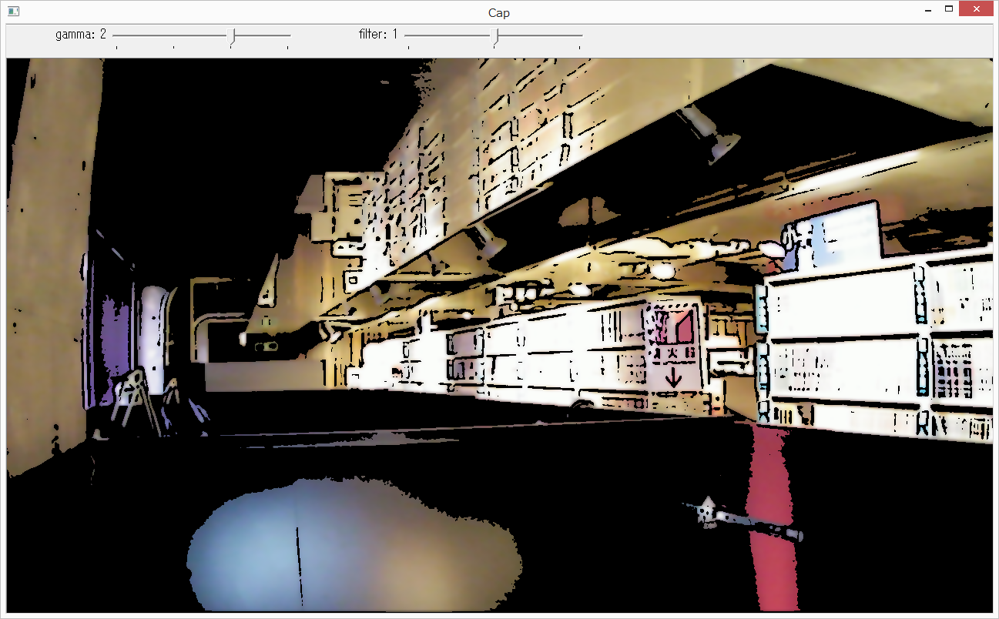

# videocap

## Description

This software displays frames captured from camera using OpenCV2 C API.

## Install OpenCV

This software requires OpenCV2.X.

### MacOS Sierra

```
$ brew update
$ brew install -v cmake
$ brew install -v pkg-config
$ brew tap homebrew/science
$ brew install opencv@2
$ export PKG_CONFIG_PATH=/usr/local/opt/opencv@2/lib/pkgconfig
```

## How to build

Enter following command under videocap folder.

```
go build
```

## Command Line Options

```
C:\>videocap -h
Usage of videocap:
  -cam_idx int
        the camera index to use
  -face_detect
        the flag to use face detection (default true)
  -file string
        the path to record video
  -filter int
        the number of filter. 0:none, 1:binary+edge, 2:ohtsu
  -size string
        the size to be captured (default "640x480")
  -wait_ms int
        the interval ms (default 100)
```

# Screenshots

* Using filter 1



* Using filter 2


