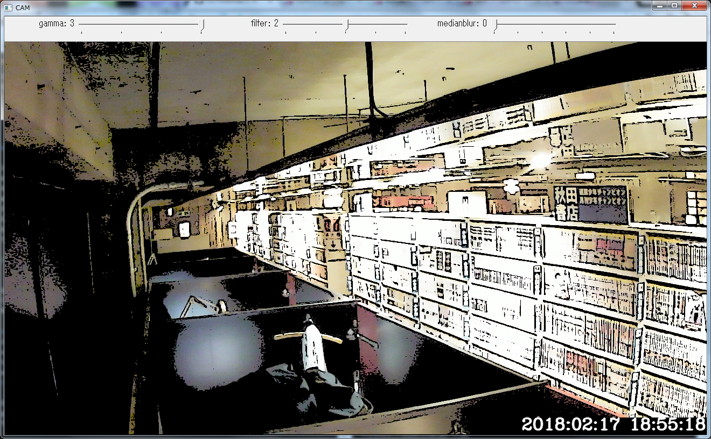
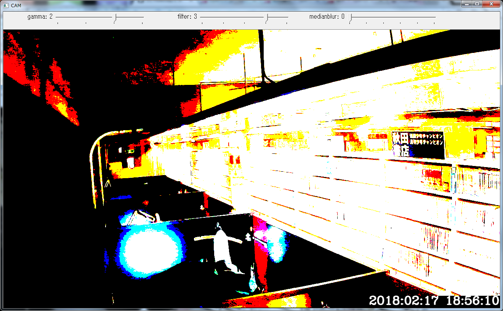
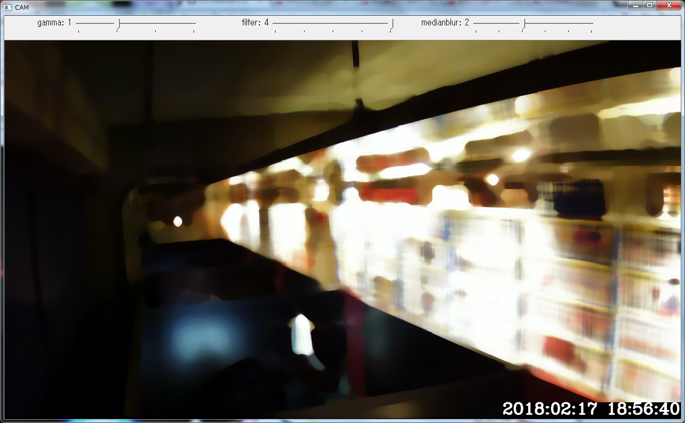

# videocap2

## Description

This software displays frames captured from camera using OpenCV2 C++ API. 

## Environment

* Windows 7 Professional SP1 64bit / Windows 10 Pro 64bit
* Go 1.9.3 windows/amd64
* MSYS64
  * gcc (Rev2, Built by MSYS2 project) 7.3.0

## Instaling MSYS64 / MINGW64

Download x86_64 installer from http://www.msys2.org/ and install.

Enter following commands at your msys console.

```
$ pacman -Sy
$ pacman -Su

(you will restart msys console.)

$ pacman -S base-devel
$ pacman -S mingw-w64-x86_64-toolchain
```

## Installing GoLang

Download x86_64 installer from https://golang.org/ and install.

## Installing OpenCV2.X.

I compiled the static library of OpenCV 2.4.13.5 for mingw/win x64.
https://github.com/bunji2/cv/releases/tag/opencv

## Environment Variables

```
rem GoLang
PATH C:\Go\bin;%PATH%

rem MSYS64 / MINGW64
PATH C:\msys64\mingw64\bin;C:\msys64\usr\bin;%PATH%

rem PKG_CONFIG
set PKG_CONFIG_PATH=C:/opencv_libs/pkgconfig
```

## How to build

Enter following command:

```
go build -o videocap2.exe
```

## Command Line Options

```
C:\work\cam>videocap -h
Using OpenCV 2.4.13.5
Usage of videocap:
  -cam_idx int
        the camera index to use
  -disp_time
        the flag to display current time (default true)
  -img_file string
        the path to save image file (default "out.png")
  -size string
        the size to be captured (default "1280x768")
  -wait_ms int
        the interval ms (default 100)
```

# Screenshots

* sample 1



* sample 2



* sample 3

